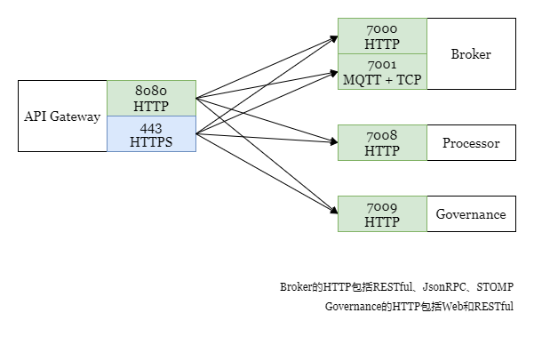

## 服务访问端口

### 默认端口映射图

### 更多说明

- 业务程序统一从Nginx接入，Broker和Governance模块作为Nginx的反向代理提供能力

- WeEvent的大部分能力都是通过端口8080访问

  `RESTful`协议的访问`URL`为 `http://localhost:8080/weevent/rest`。

  `JsonRPC`协议的访问`URL`为 `http://localhost:8080/weevent/jsonrpc`。

  `STOMP`协议基于`WebSocket`的 访问`URL`为`ws://localhost:8080/weevent/stomp`，如果是基于`SockJS`则为`http://localhost:8080/weevent/sockjs`。

- MQTT协议的访问端口有别于以上协议

  基于`TCP`的访问`Host`为`localhost:8081/weevent/mqtt`。
  基于`WebSocket`的访问`URL`为`ws://localhost:8083/weevent/mqtt`。

- 由Nginx负责处理安全传输TLS

  客户端无论使用HTTP还是HTTPS访问，Nginx都是通过HTTP访问Broker和Governance，TCP/TLS也是类似处理。同一种功能，按是否通过`TLS`访问，`Nginx`端口有如下对应关系：

  |                     | 普通传输 | TLS传输 |
  | ------------------- | -------- | ------- |
  | HTTP/STOMP          | 8080     | 443     |
  | MQTT over TCP       | 8081     | 8082    |
  | MQTT over WebSocket | 8083     | 8084    |

- 以上说明全是指默认端口，  所有端口都支持自定义配置

