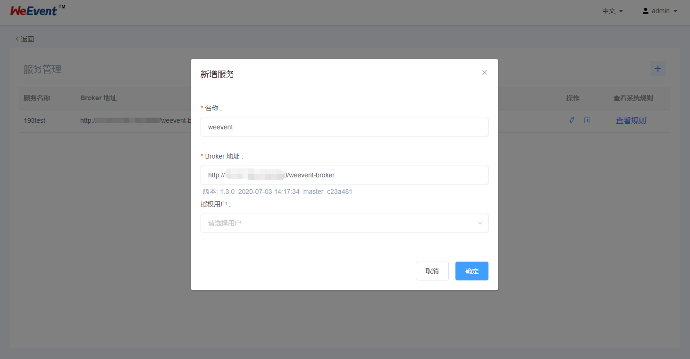

## Governance模块
如果是第一次安装`WeEvent`，参见这里的[系统要求](../environment.html) 。以下安装以`CentOS 7.2`为例。

因为区块链使用的加密算法很多`OpenJDK`版本没有提供。所以在各`Java`启动脚本里有设置`JAVA_HOME`变量让用户设置符合要求的`JDK`。

### 前置条件

- Zookeeper服务

  必选配置。服务注册和发现会使用到。

  推荐使用`Zookeeper 3.5.5`版本。具体安装步骤，请参见[Zookeeper安装](http://zookeeper.apache.org/doc/r3.4.13/zookeeperStarted.html)。

- Broker模块

   必选配置，通过`Broker`访问区块链。

   具体安装步骤，请参见[Broker模块安装](./broker.html)。

- Mysql数据库

  可选配置。支持`Mysql`存储数据，如果不配置则使用内置的`H2`数据库。如果要使用Mysql数据库，需要做一个
  切换，切换步骤，请参考[FAQ](https://weeventdoc.readthedocs.io/zh_CN/latest/faq/weevent.html)。

  推荐安装`Mysql 5.7+`版本。具体安装步骤，安装请参见[Mysql安装](http://dev.mysql.com/downloads/mysql/) 。
  
- Processor模块
  可选配置。通过`Processor`触发规则引擎。
  具体安装步骤，请参见[Processor模块安装](./processor.html)。


### 获取安装包

从`github`下载安装包[weevent-governance-1.2.0.tar.gz](https://github.com/WeBankFinTech/WeEvent/releases/download/v1.2.0/weevent-governance-1.2.0.tar.gz)，并且解压到`/usr/local/weevent/`下。

```shell
$ cd /usr/local/weevent/
$ wget https://github.com/WeBankFinTech/WeEvent/releases/download/v1.2.0/weevent-governance-1.2.0.tar.gz
$ tar -xvf weevent-governance-1.2.0.tar.gz
```

如果`github`下载速度慢，可以尝试[国内下载链接](https://www.fisco.com.cn/cdn/weevent/download/releases/v1.2.0/weevent-governance-1.2.0.tar.gz)。

解压后的目录结构如下

```
$ cd ./weevent-governance-1.2.0
$ tree -L 1
|-- apps
|-- check-service.sh
|-- conf
|-- governance.sh
|-- html
|-- init-governance.sh
|-- lib
```

### 修改配置文件

- 配置Zookeeper服务

  可选配置。`./conf/application-prod.properties`中`spring.cloud.zookeeper`配置项。
  
  ```ini
  # spring cloud zookeeper
  spring.cloud.zookeeper.enabled=true
  spring.cloud.zookeeper.connect-string=127.0.0.1:2181
  ```
  
- 配置端口

  在配置文件`./conf/application-prod.properties`中，`Governance` 的服务端口`server.port` ，默认`7009`。

  ```
  server.port=7009
  ```

- 配置Processor访问路径

    初始化系统，执行脚本`init-governance.sh` ，成功输出如下。否则，用户需要检查配置项是否正常。

    ```shell
    $ ./init-governance.sh
    init governance db success
    ```

- 重置密码的邮件设置

    可选配置。在配置文件`./conf/application-prod.properties`中，修改`mail`中的`host`、`username`、`password` 配置。

    ```ini
	spring.mail.default-encoding= UTF-8
	spring.mail.host= smtp.163.com
	spring.mail.username= mailusername@163.com
	spring.mail.password= mailpwd
    ```

### 初始化数据库

执行脚本`init-governance.sh` 初始化数据库，成功输出如下。否则，用户需要检查数据库配置是否正常。

```shell
$ ./init-governance.sh
init governance db success
```

### 服务启停

- 服务启动

  通过`./governance.sh start`命令启动服务，正常启动如下：

  ```shell
  $ ./governance.sh start
  start weevent-governance success (PID=53926)
  add the crontab job success
  ```

  通过`./governance.sh stop`命令停止服务。

  进程启动后，会自动添加`crontab`监控任务`./governance.sh monitor`。

- 验证服务

  通过`./check-service.sh` 命令检查服务功能是否正常。

  ```shell
  $ ./check-service.sh
  check governance service
  governance service is ok
  ```


### 多视图管理

`Governance`支持同时管理多个`WeEvent`服务和区块链网络， 配置界面如下。




### 其他
推荐安装`Processor`。具体安装步骤，请参见[Processor安装](https://weeventdoc.readthedocs.io/en/latest/install/module/processor.html)。

