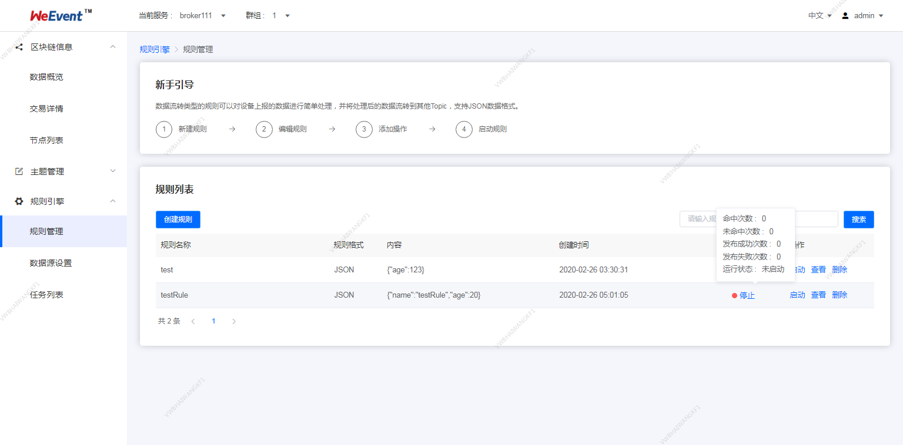

## Processor模块

如果是第一次安装`WeEvent`，参见这里的[系统要求](../environment.html) 。以下安装以`CentOS 7.2`为例。

因为区块链使用的加密算法很多`OpenJDK`版本没有提供。所以在各`Java`启动脚本里有设置`JAVA_HOME`变量让用户设置符合要求的`JDK`。

#### 前置条件
- Zookeeper服务

  必选配置。服务注册和发现会使用到。

  推荐使用`Zookeeper 3.5.5`及其以上版本。具体安装步骤，请参见[Zookeeper安装](https://zookeeper.apache.org/doc/r3.5.7/zookeeperStarted.html)。


- Broker模块

   必选配置，通过`Broker`访问区块链。

   具体安装步骤，请参见[Broker模块安装](./broker.html)。
- Governance模块

   具体安装步骤，请参见[Governance模块安装](./governance.html)。   


- Mysql数据库

  可选配置。支持`Mysql`存储数据，如果不配置则使用内置的`H2`数据库。如果要使用Mysql数据库，需要做一个
  切换，切换步骤，请参考[FAQ](https://weeventdoc.readthedocs.io/zh_CN/latest/faq/weevent.html)。

  推荐安装`Mysql 5.7+`版本。具体安装步骤，安装请参见[Mysql安装](http://dev.mysql.com/downloads/mysql/) 。

### 获取安装包

从`github`下载安装包[weevent-processor-1.6.0.tar.gz](https://github.com/WeBankBlockchain/WeEvent/releases/download/v1.6.0/weevent-processor-1.6.0.tar.gz)，并且解压到`/usr/local/weevent/`下。

```shell
$ cd /usr/local/weevent/
$ wget https://github.com/WeBankBlockchain/WeEvent/releases/download/v1.6.0/weevent-processor-1.6.0.tar.gz
$ tar -xvf weevent-processor-1.6.0.tar.gz
```


解压后的目录结构如下

```
$ cd ./weevent-processor-1.6.0
$ tree -L 1
.
|-- apps
|-- check-service.sh
|-- conf
|-- cep_rule.sql
|-- init-processor.sh
|-- processor.sh
|-- lib
```

### 修改配置文件
- 配置Zookeeper服务

  可选配置。`./conf/application-prod.properties`中`spring.cloud.zookeeper`配置项。
  
  ```ini
  # spring cloud zookeeper
  spring.cloud.zookeeper.enabled=true
  spring.cloud.zookeeper.connect-string=127.0.0.1:2181
  ```
  
- 配置端口

  在配置文件`./conf/application-prod.properties`中，`Processor` 的服务端口`server.port` ，默认`7008`。

   ```
   server.port=7008
   ```
  
- 配置文件processor.properties

   - `org.quartz.scheduler.instanceName` 当前Schedule name，用户可以修改
   - `org.quartz.dataSource`  数据库名称，默认为`WeEvent_processor`，用户可以修改

- 初始化数据库，

   执行脚本`init-processor.sh` ，成功输出如下。否则，用户需要检查配置项是否正常。
   
   ```shell
   $ ./init-processor.sh
   init processor db success
   ```

#### 服务启停

通过`./processor.sh start`命令启动服务，正常启动如下：

```shell
$ ./processor.sh start
  start weevent-processor success (PID=53927)
  add the crontab job success
```

  通过`./processor.sh stop`命令停止服务。

  进程启动后，会自动添加`crontab`监控任务`./processor.sh monitor`。

### 界面展示

1. 创建规则

```
      {
         "ruleName":"alarm", 
         "type":"json",
         "payload":{
               "temperate":30,
               "humidity":0.5
            }
         "ruleDescription": ""
      }
```

- ruleName: 支持英文字母、数字、下划线、连字符
- type：该规则处理数据的格式，目前只支持JSON格式
- payload: 规则的内容
- ruleDescription: 对规则的补充描述


2. 设置触发 

   JSON数据可以映射为虚拟的表，其中Key对应表的列，Value对应列值，这样就可以使用SQL处理。为便于理解，我们将数据流转的一条规则抽象为一条SQL表达（类试MySQL语法）：

   

   例如某环境传感器用于火灾预警，可以采集温度、湿度及气压数据，上报数据内容如下：

   ```
   {
   "temperature":25.1,
   "humidity":65,
   "type":"warning",
   "range":"higher",
   "date": "2019-10-22"
   }
   ```

   假定温度大于38，湿度小于40时，需要触发报警，可以编写如下的SQL语句：

   ```
   SELECT temperature, deviceName FROM ProductA WHERE temperature > 38 and humidity < 40
   ```
   当上报的数据中，温度大于38且湿度小于40时，会触发该规则，并且解析数据中的温度、设备名称，用于进一步处理。

   - 触发条件 `(temperature > 38 and humidity < 40)`
   - Topic:自定义和通配符 
   - MySQL 说明：
         JSON数据格式
         SELECT语句中的字段，可以使用上报消息的payload解析结果，即JSON中的键值，也可以使用SQL内置的函数，比如deviceName。
         支持*，不支持子SQL查询。
         
         FROM
         FROM 可以填写Topic。Topic中的设备名（deviceName），用于匹配需要处理的设备消息Topic。当有符合Topic规则的消息到达时，消息的payload数据以JSON格式解析，并根据SQL语句进行处理（如果消息格式不合法，将忽略此消息）。
            
         WHERE
         规则触发条件，条件表达式。不支持子SQL查询。WHERE中可以使用的字段和SELECT语句一致，当接收到对应Topic的消息时，WHERE语句的结果会作为是否触发规则的判断条件。`WHERE temperature > 38 and humidity < 40` 表示温度大于38且湿度小于40时，才会触发该规则，执行配置。
         
       - 可以进条件查询` >、<、>=、<=、<>、!=` ，具体详情见本章最后章节。

   

3. 规则详情展示

   用户可以继续编辑规则的规则描述、`SELECT`、`FROM`、`WHERE`。

   


4. 规则列表展示

   用户可以查询规则、创建规则、编辑规则、启动规则、停止规则、删除规则。并且通过规则的状态可查看该规则的运行状态及命中次数等信息。

   


#### 命中逻辑说明

   - 文本字段 vs. 数值字段

   ```
   SELECT * FROM Websites WHERE country='CN';
   ```

   - 支持的类型 运算符

| =    | 等于                              |
| ---- | ------------------------------- |
| <>   | 不等于。注释：在 SQL 的一些版本中，该操作符可被写成 != |
| >    | 大于                              |
| <    | 小于                              |
| >=   | 大于等于                            |
| <=   | 小于等于                            |


   数字类型

   ```
   temperature=29;
   temperature>29;
   temperature>=29;
   temperature<29;
   temperature<=29;
   temperature<>29;
   ```

   文本类型

   ```
   SELECT * FROM Websites WHERE facilicty-charater="warning";
   ```

   - AND & OR 运算符

   如果第一个条件和第二个条件都成立，则 and 运算符显示一条记录。

   如果第一个条件和第二个条件中只要有一个成立，则 or 运算符显示一条记录。

   ```
   SELECT * FROM Websites WHERE facilicty-charater="warning" and temperature > 50;

   SELECT * FROM Websites WHERE temperature > 35 or  facilicty-charater=="warning" ;
   ```

   - 非聚合类的内置函数
     - 数字计算abs(绝对值)，ceil，floor ，round  
     ```
      SELECT * FROM Websites WHERE abs(temperature) > 50;

      SELECT * FROM Websites WHERE ceil(temperature) > 50;

      SELECT * FROM Websites WHERE floor(temperature) > 50;

      SELECT * FROM Websites WHERE round(temperature) > 50;
     ```

     - 字符串拼接substring，concat，trim，lcase 
     
     ```
      SELECT * FROM Websites WHERE range.substring(6)=="warning-001";

      SELECT * FROM Websites WHERE range.substring(5,10)=="test";

      SELECT * FROM Websites WHERE range.concat(type)=="higherwarning";

      SELECT * FROM Websites WHERE range.trim()=="higher";

      SELECT * FROM Websites WHERE lcase(range)=="higher";
     ```
     
   - 内置时间
     

   时间选取now， currentDate，currentTime
   ```
    SELECT * FROM Websites WHERE date >= currentDate;
   ```

   