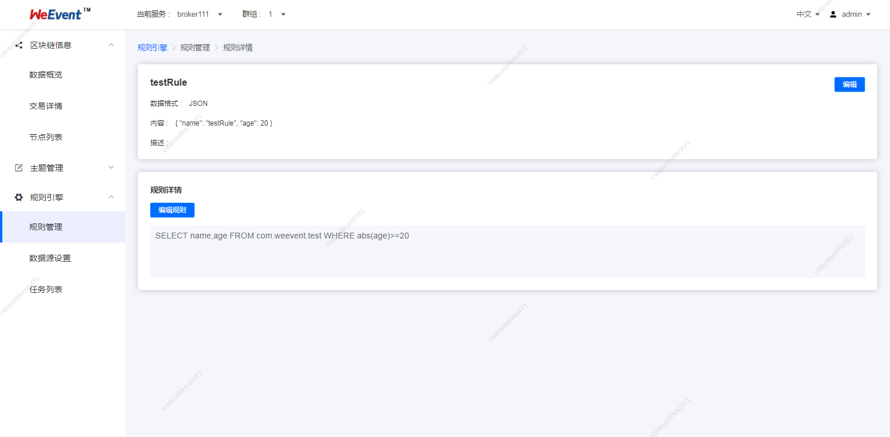

## Processor模块

本节介绍`Processor`子模块的详细安装步骤。 `WeEvent`服务的快速安装请参见[快速安装](../quickinstall.html) 。在一台机器上详细安装，和通过快速安装然后把目标路径中的`Processor`子目录打包拷贝到这台机器，效果是一样的。

`Processor`为用户提供时序流分析和时间联动等。如果是第一次安装`WeEvent`，参见这里的[系统要求](../environment.html) 。以下安装以`CentOS 7.2`为例。

#### 前置条件

- Broker模块

   必选配置，通过`Broker`访问区块链。

   具体安装步骤，请参见[Broker模块安装](./broker.html)。
- Governance模块

   必选配置，通过`Governance`从`Web`端调用Processor。修改配置文件`./governance/conf/application-prod.properties` ，增加processor对应的ip和端口配置` weevent.processor.url=http://127.0.0.1:7008`。

   具体安装步骤，请参见[Governance模块安装](./governance.html)。   


- Mysql数据库

  必选配置。`Processor`通过`Mysql`存储数据。

  推荐安装`Mysql 5.6+`版本。具体安装步骤，安装请参见[Mysql安装](http://dev.mysql.com/downloads/mysql/) 。

### 获取安装包

从`github`下载安装包[weevent-processor-1.1.0.tar.gz](https://github.com/WeBankFinTech/WeEvent/releases/download/v1.1.0/weevent-processor-1.1.0.tar.gz)，并且解压到`/usr/local/weevent/`下。

```shell
$ cd /usr/local/weevent/
$ wget https://github.com/WeBankFinTech/WeEvent/releases/download/v1.1.0/weevent-processor-1.1.0.tar.gz
$ tar -xvf weevent-processor-1.1.0.tar.gz
```

如果`github`下载速度慢，可以尝试[国内下载链接](https://www.fisco.com.cn/cdn/weevent/download/releases/v1.1.0/weevent-processor-1.1.0.tar.gz)。

解压后的目录结构如下

```
$ cd ./weevent-processor-1.1.0
$ tree -L 2

```

```
$ cd ./weevent-processor-1.1.0
$ tree -L 2
|-- apps
|   `-- weevent-processor-1.1.0.jar
|-- check-service.sh
|-- conf
|   |-- application-prod.properties
|   |-- application.properties
|   |-- log4j2.xml
|   |-- mappers
|   |-- processor.properties
|-- cep_rule.sql
|-- init-processor.sh
|-- processor.sh
|-- lib
```

### 修改配置文件
- 配置端口

  在配置文件`./conf/application-prod.properties`中，`Processor` 的服务端口`server.port` ，默认`7008`。

   ```
   server.port=7008
   ```

- 默认配置H2数据库
   修改`datasource`中的`url`配置、`username`、`password` 

   ``` 配置数据库连接
   server.port=7008
   spring.datasource.url=jdbc:mysql://127.0.0.1:3306/processor
   spring.datasource.username=root
   spring.datasource.password=123456
   spring.datasource.driver-class-name=org.mariadb.jdbc.Driver
   ```

- 切换Mysql数据库
注意这里的切换需要和governance数据源同步切换

- 在配置文件processor.properties配置Mysql数据库,修改`datasource`中的`url`配置、`username`、`password` 
   ```
   #============================================================================
   # config name and expression
   #============================================================================
   quartz.schedule.name=schedule
   #============================================================================
   # Configure Main Scheduler Properties
   #============================================================================
   org.quartz.scheduler.instanceName=test
   #============================================================================
   # Configure Datasources
   #============================================================================
   org.quartz.dataSource.WeEvent_processor.URL=jdbc:mysql://127.0.0.1:3306/WeEvent_processor
   org.quartz.dataSource.WeEvent_processor.user=xxxx
   org.quartz.dataSource.WeEvent_processor.password=yyyy
   org.quartz.dataSource.WeEvent_processor.maxConnections=30
   org.quartz.dataSource.WeEvent_processor.driver=org.mariadb.jdbc.Driver
   #============================================================================
   # Configure JobStore
   #============================================================================
   org.quartz.jobStore.dataSource=WeEvent_processor
   #============================================================================
   # Configure ThreadPool Quartz
   #============================================================================
   org.quartz.threadPool.threadCount=20
   org.quartz.threadPool.threadPriority=5
   ```

   - `org.quartz.scheduler.instanceName` 当前Schedule name，用户可以修改
   - `org.quartz.dataSource.weevent_processor.*`  数据库信息的配置
   - `org.quartz.jobStore.dataSource` 配置数据库名称

​    **注意**：数据库要赋予配置账号创建库表的权限。

   ```shell
   mysql
   >> grant all privileges on . to 'test'@'%' identified by '123456';
   >> flush privileges;
   ```

​   初始化系统，执行脚本`init-processor.sh` ，成功输出如下。否则，用户需要检查配置项是否正常。

```
$ ./init-processor.sh
init processor db success
```

#### 服务启停

- 服务启动

  通过`./processor.sh start`命令启动服务，正常启动如下：

```shell
$ ./processor.sh start
  start weevent-processor success (PID=53927)
  add the crontab job success
```

  通过`./processor.sh stop`命令停止服务。

  进程启动后，会自动添加`crontab`监控任务`./processor.sh monitor`。

- 验证服务

   通过`./check-service.sh` 命令检查服务功能是否正常。

   ```shell
      $ ./check-service.sh
      check processor service
      processor service is ok
   ```
### 界面展示

1. 创建规则

```
      {
         "ruleName":"alarm", 
         "type":"json",
         "payload":{
               "temperate":30,
               "humidity":0.5
            }
      }
```

- ruleName: 支持英文字母、数字、下划线、连字符
- type：改规则处理数据的格式，目前只支持JSON格式。
- 规则的详细描述。


2. 设置触发 

   JSON数据可以映射为虚拟的表，其中Key对应表的列，Value对应列值，这样就可以使用SQL处理。为便于理解，我们将数据流转的一条规则抽象为一条SQL表达（类试MySQL语法）：

   

   例如某环境传感器用于火灾预警，可以采集温度、湿度及气压数据，上报数据内容如下：

   ```
   {
   "temperature":25.1,
   "humidity":65
   }
   ```

   假定温度大于38，湿度小于40时，需要触发报警，可以编写如下的SQL语句：

   ```
   SELECT temperature, deviceName FROM ProductA WHERE temperature > 38 and humidity < 40
   ```
   当上报的数据中，温度大于38且湿度小于40时，会触发该规则，并且解析数据中的温度、设备名称，用于进一步处理。

   - 触发条件 `(temperature > 38 and humidity < 40)`
   - Topic:自定义和通配符 
   - MySQL 说明：
         JSON数据格式
         SELECT语句中的字段，可以使用上报消息的payload解析结果，即JSON中的键值，也可以使用SQL内置的函数，比如deviceName。
         支持*，不支持子SQL查询。
         
         FROM
         FROM 可以填写Topic。Topic中的设备名（deviceName），用于匹配需要处理的设备消息Topic。当有符合Topic规则的消息到达时，消息的payload数据以JSON格式解析，并根据SQL语句进行处理（如果消息格式不合法，将忽略此消息）。

         WHERE
         规则触发条件，条件表达式。不支持子SQL查询。WHERE中可以使用的字段和SELECT语句一致，当接收到对应Topic的消息时，WHERE语句的结果会作为是否触发规则的判断条件。`WHERE temperature > 38 and humidity < 40` 表示温度大于38且湿度小于40时，才会触发该规则，执行配置。
         
       - 可以进行单条件查询` >、<、>=、<=、<>、!=` ，具体详情见本章最后章节。

   

3. 规则详情展示

   用户可以继续编辑规则的规则描述、`SELECT`、`FROM`、`WHERE`。

   


4. 规则列表展示

   用户可以查询规则、创建规则、编辑规则、启动规则、停止规则、删除规则。

   


#### 命中逻辑说明

   - 不支持嵌套查询、连表查询、自带函数查询、ORDER BY（ASC|DESC）


   - 文本字段 vs. 数值字段

   ```
   SELECT * FROM Websites WHERE country='CN';
   ```

   - 支持的类型 运算符

   | =    | 等于                              |
   | ---- | ------------------------------- |
   | <>   | 不等于。注释：在 SQL 的一些版本中，该操作符可被写成 != |
   | >    | 大于                              |
   | <    | 小于                              |
   | >=   | 大于等于                            |
   | <=   | 小于等于                            |


   数字类型

   ```
   temperature=29;
   temperature>29;
   temperature>=29;
   temperature<29;
   temperature<=29;
   temperature<>29;
   ```

   文本类型

   ```
   SELECT * FROM Websites WHERE facilicty-charater="warning";
   ```

   - AND & OR 运算符

   如果第一个条件和第二个条件都成立，则 and 运算符显示一条记录。

   如果第一个条件和第二个条件中只要有一个成立，则 or 运算符显示一条记录。

   ```
   SELECT * FROM Websites WHERE facilicty-charater="warning" and temperature > 50;

   SELECT * FROM Websites WHERE temperature > 35 or  facilicty-charater="warning" ;
   ```