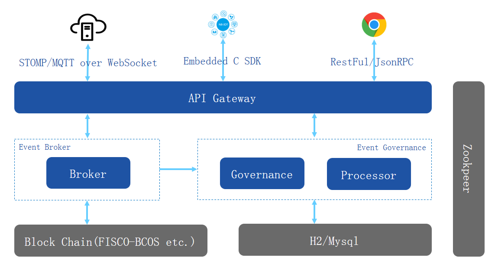

## 架构说明

`WeEvent`服务使用[Spring Boot](https://spring.io/projects/spring-boot)框架开发。业务集成上，既支持直接加载独立的`JAR`包使用服务，例如`weevent-core.jar `、`weevent-file.jar`等。也支持通过代理服务来提供功能，例如`weevent-broker`、`weevent-governance`、`weevent-processor`。

### 各子块服务简介

- weevent-broker

  `WeEvent`的事件代理模块，提供核心的事件发布订阅`Pub`/`Sub`以及`Topic`管理功能。

  `weevent-broker`就是`weevent-core.jar `的服务化，以支持各种协议接入。

- weevent-governance

  `WeEvent`的事件治理模块，提供一个`Web`管理端。支持区块链信息浏览、`Topic`事件治理、流计算、大文件传输等。

  使用数据库持久化相关数据，支持`H2`和`Mysql`。

- weevent-processor

    是`weevent-governance`实时流计算功能中，规则引擎的分布式运行容器。
    
- API Gateway

    `WeEvent`服务对外统一的访问入口，负责接入请求的负载均衡、限流、熔断等。
    
- FISCO-BCOS

    `WeEvent`的事件永久存储在区块链上。推荐使用[FISCO-BCOS](https://github.com/FISCO-BCOS/FISCO-BCOS)，也支持`Fabric 1.4`。

### 系统架构

