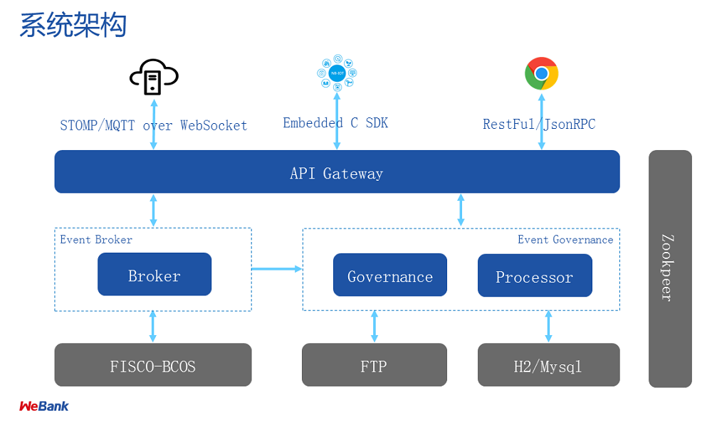

## 架构说明

`WeEvent`主要使用[Spring Boot](https://spring.io/projects/spring-boot)框架开发。分为`Broker`和`Governance`两个子模块，`Broker`负责事件发布和订阅以及访问区块链`FISCO-BCOS`，`Governance`提供一个`Web`管理端实现事件治理。整个服务使用`Nginx`实现负载均衡。

### 模块说明

- Nginx

  `WeEvent`服务对外统一的访问入口，负责服务请求的负载均衡。支持`RESTful`、`JsonRPC`、`STOMP`、`MQTT`等协议，以及`Java SDK`。

- Broker

  `WeEvent`的事件代理模块，提供核心的事件发布订阅`Publish`/`Subscribe`和`Topic`管理功能。

  其中，使用`Redis`缓存事件，使用`Zookeeper`主备切换。

- Governance

  `WeEvent`的事件治理模块，提供一个`Web`管理端。

  其中，使用`Mysql`数据库存储`Topic`的统计数据，使用[WeBase](https://github.com/WeBankFinTech/WeBASE)访问区块链管理类接口。
  
- FISCO-BCOS
  
    `WeEvent`的事件永久存储在区块链[FISCO-BCOS](https://github.com/FISCO-BCOS/FISCO-BCOS)上，一个区块链可以对应一个或者多个`WeEvent`服务。

### 架构设计

