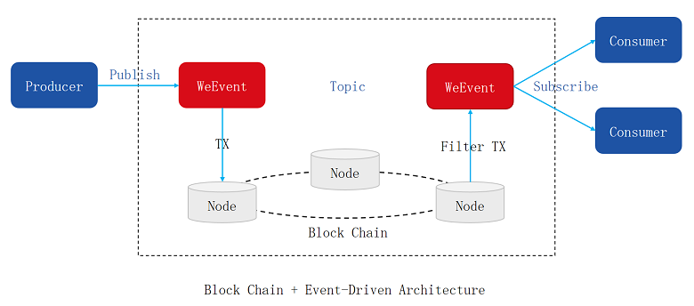

## 核心概念

`WeEvent`是一个基于区块链实现的事件中间件，面向用户提供事件发布订阅`Publish/Subscribe`功能。发布到`WeEvent`上的事件永久存储，不可篡改，支持事后跟踪和审计。
生产者`Producer`通过`WeEvent`服务发布事件，事件内容会被记录到区块链`FISCO-BCOS`上，消费者`Consumer`从`WeEvent`服务订阅事件。订阅成功后，只要生产者发布事件，消费者都会及时得到通知。

  

多机构之间的合作，一般每个机构都会部署自己的`WeEvent`服务。例如：

机构A通过属于A的`WeEvent`服务发布事件，机构B通过自己的`WeEvent`服务订阅事件。如果生产者和发布者属于同一机构，可以使用同一套`WeEvent`服务。

### 事件（Event）  
事件`Event`可以简单理解成业务层面的一个消息。一般是终端用户或设备触发。

一个事件分为四部分，关联的主题、事件内容、事件ID`EventID`和可选的自定义属性。`Java`映射类参见[WeEvent.java](https://github.com/WeBankFinTech/WeEvent/blob/master/weevent-client/src/main/java/com/webank/weevent/sdk/WeEvent.java)。

事件内容是一个字节数组`byte[]`，对`WeEvent`是透明的。业务可以存放任何数据，例如字符型的`Json`、`XML` ，或者二进制的`Protocol Buffer`等。

### 主题（Topic）  
业务上一般把数据结构相同，属于同类型的事件归属于同一主题`Topic`。

每个主题`Topic`逻辑上都有彼此独立的队列。主题之间是完全隔离的，存储、通知都不会互相影响。  

### 发布事件（Publish）  
生产者`Producer`往某个主题发布事件，`WeEvent`会将事件永久存储在区块链`FISCO-BCOS`上，不可篡改，支持事后审核。

事件发布成功后`WeEvent`会返回一个事件ID`EventID` ，事件ID代表该事件且具有唯一性。

### 订阅事件（Subscribe）  
消费者`Consumer`订阅某个主题后，当有生产者往该主题发布事件，消费者会及时收到事件通知。

订阅成功时`WeEvent`会返回一个的订阅ID`SubscriptionID`，代表完成一次订阅，订阅ID具有唯一性。

除了实时订阅最新的事件，`WeEvent`也支持从某个历史事件`EventID`之后开始订阅。

### 取消订阅（Unsubscribe）  
消费者通过订阅ID`SubscriptionID` 取消一个订阅后，不会再收到该主题的事件通知。
