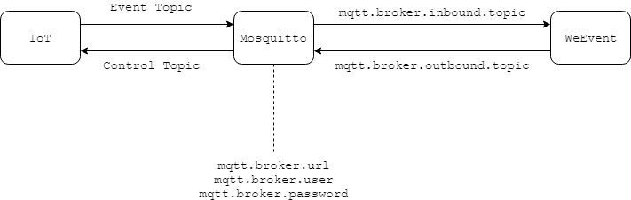

## MQTT
`WeEvent`服务对`MQTT`协议的支持依赖`Mosquitto`代理。`Mosquitto`是 `MQTT` 协议的一个开源实现。`Mosquitto`详细内容，请参见[Mosquitto官网](https://mosquitto.org/) 。同时需要给`Broker`配置`Zookeeper`服务。请参见[Broker模块安装](../install/module/broker.html)。

### 协议介绍

- `MQTT`是物联网`IoT`中的主流接入协议，协议具体内容参见[http://mqtt.org/](http://mqtt.org/) 
- `WeEvent`支持`MQTT 3.1.1`
### MQTT桥接概念

`WeEvent` 关于物联网`IoT`设备接入的流程如下图：

  

`WeEvent`使用`Mosquitto`来做`MQTT`协议代理，也可以使用`EMQ`等商业软件，支持`MQTT 3.1.1`就可以。

`IoT`设备往服务器发布事件，一般用来做数据采集，称为上行通道。对应`WeEvent`使用`mqtt_add_inbound_topic` 接口来设置桥接。

服务器往`IoT`设备发布事件，一般用来做控制命令，称为下行通道。对应`WeEvent`使用`mqtt_add_outbound_topic`接口来设置桥接。

### 配置MQTT桥接

 在`Broker`服务中，修改配置文件`./conf/weevent.properties`，然后重新启动服务。

  ```ini
#mqtt broker
#mosquitto安装所在服务器的ip地址及端口号
mqtt.broker.url=tcp://127.0.0.1:1883
#mosquitto使用的用户名  
mqtt.broker.user=${user}  
#mosquitto使用的密码               
mqtt.broker.password=${password}           
mqtt.broker.qos=2
mqtt.broker.timeout=5000
#mosquitto default 20s
mqtt.broker.keep-alive=15
#zookeeper
#zookeeper安装所在服务器的ip地址及端口号
broker.zookeeper.ip=127.0.0.1:2181     
broker.zookeeper.path=/event_broker
broker.zookeeper.timeout=3000
  ```

### 样例演示

#### IoT设备数据采集

- 在`WeEvent`中创建主题`Topic` ，例如 `com.weevent.iot.event`。

  ```shell
  $ curl http://localhost:8080/weevent/rest/open?topic=com.weevent.iot.event&groupId=1
  true
  ```
  
  `groupId`:群主`Id`，`fisco-bcos 2.0+`版本支持多群主功能，2.0以下版本不支持该功能可以不传。
  
- 通过`WeEvent`设置上行通道的`Topic`绑定。

  ```shell
  $ curl http://localhost:8080/weevent/master/mqtt_add_inbound_topic?topic=com.weevent.iot.event&groupId=1
  true
  ```


- `IoT`设备发布事件

  `IoT`设备和传统方式一样通过`MQTT`协议发布事件。

  ```shell
  $ mosquitto_pub -h localhost -p 1883 -u ${user} -P ${password} -t "com.weevent.iot.event" -m "{\"timestamp\":133345566,\"key\":\"temperature\",\"value\":10.0}"
  ```


- 通过`WeEvent`订阅事件

  在`WeEvent`上订阅该主题`com.weevent.iot.event`，就可以得到`IoT`设备发送上来的数据。

- 移除绑定，`WeEvent`不会再收到事件通知

  ```shell
  $ curl http://localhost:8080/weevent/master/mqtt_remove_inbound_topic?topic=com.weevent.iot.event&groupId=1
  ```

#### 下发IoT设备命令

- 在`WeEvent`里创建主题`Topic` ，例如`com.weevent.iot.control`。

  ```shell
  $ curl http://localhost:8080/weevent/rest/open?topic=com.weevent.iot.control&groupId=1
  true
  ```


- 通过`WeEvent`设置下行通道的`Topic`绑定

  ```shell
  $ curl http://localhost:8080/weevent/master/mqtt_add_outbound_topic?topic=com.weevent.iot.control&groupId=1
  true
  ```


- 在`WeEvent`上发布事件

  ```shell
  $ curl http://localhost:8080/weevent/rest/publish?topic=com.weevent.iot.control&groupId=1&content=hello&weevent-url=https://github.com/WeBankFinTech/WeEvent
  ```
  
  `weevent-url`:用户自定义拓展，以`weevent-`开头。可选参数。
  
- 在设备上可以订阅到这个事件

  ```shell
  $ mosquitto_sub -h localhost -p 1883 -u ${user} -P ${password} -t "com.weevent.iot.control"
  ```


- 移除绑定，`IoT`设备不会再收到事件通知

  ```shell
  $ curl http://localhost:8080/weevent/master/mqtt_add_inbound_topic?topic=com.weevent.iot.control&groupId=1
  ```
