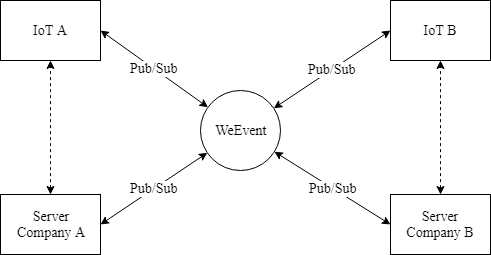

## 物联网接入
这属于`WeEvent`的全新实践，虽然有点超前，但是属于未来的方向。

在`5G`时代，网络的带宽和延迟已经不是问题。通过`WeEvent`完全可以做到端到端的数据通知和触达，无需通过各自公司内部后台服务的转发。

例如，A公司的`IoT`设备可以直接在终端通过接入`WeEvent`发布事件，任何其他感兴趣公司的`IoT`设备直接在终端上通过接入`WeEvent`订阅该事件。通过`WeEvent`的`Event Processor`加入业务的权限控制或者自定义事件流。

[Github标题1](#github标题1)

### Github标题1