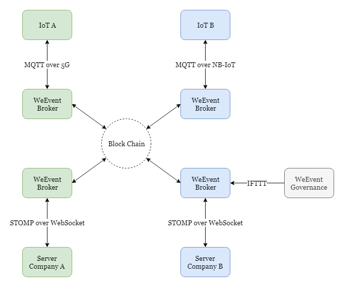

## 物联网接入
物联网 + 区块链，一个可信任的万物互联数据平台。

在`5G`时代，网络质量特别是延迟已经不是问题。通过`WeEvent`完全可以做到`IoT`设备间端到端的数据通知和触达，无需经过`IoT`厂商的各自内部后台服务的路由转发。

例如，A公司的`IoT`设备可以直接在终端通过接入`WeEvent`发布事件，任何其他感兴趣公司的`IoT`设备直接在终端上通过接入`WeEvent`订阅该事件。以此达到设备间的互联互通。同时在`WeEvent`的管理端`Governance`上，通过`CEP`模块自助编辑各种`IFTTT`事件流。

